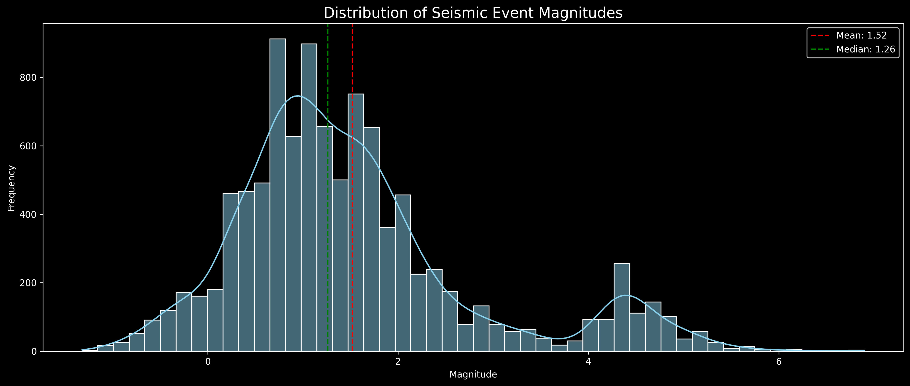
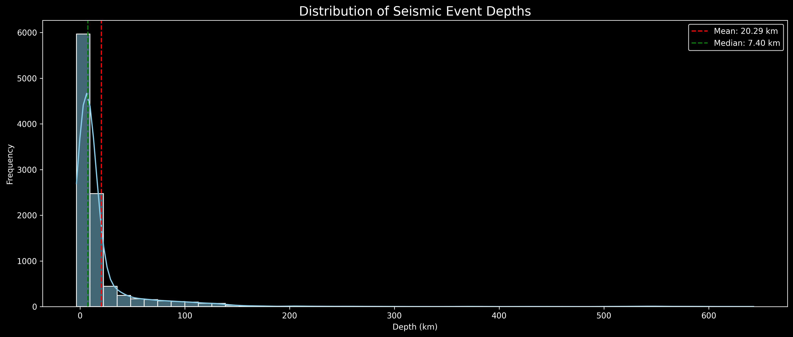
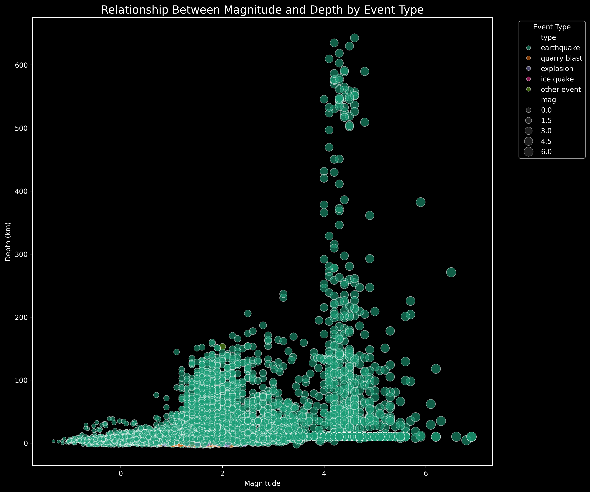

# 🌎 Earthquake Data Analysis

[](https://www.python.org/)
[](https://jupyter.org/)
[](LICENSE)
[](https://pandas.pydata.org/)
[](https://matplotlib.org/)
[](https://scikit-learn.org/)
[](https://plotly.com/)

<p align="center">
  

</p>

Welcome! This repository showcases a robust, end-to-end data science workflow for analyzing global earthquake data. If you're looking for a project that combines real-world data, advanced analytics, and modern Python visualization, you're in the right place.

## 🔄 Refactorización del Código de Visualización

**¡NUEVO!** El código de visualización ha sido completamente refactorizado en un módulo reutilizable llamado `viz_utils.py`. Esta refactorización permite:

- Crear visualizaciones con un estilo visual consistente
- Reducir la duplicación de código en todo el proyecto
- Obtener gráficos profesionales con una sola línea de código
- Mantener los mismos docstrings informativos del código original

<details>
<summary>📋 Table of Contents</summary>
<br>
  
- [🌎 Earthquake Data Analysis](#-earthquake-data-analysis)
  - [🚀 Project Highlights](#-project-highlights)
  - [📁 Files](#-files)
  - [🛠️ Requirements](#️-requirements)
  - [📝 How to Use](#-how-to-use)
  - [🎨 Visual Outputs](#-visual-outputs)
  - [💡 Insights](#-insights)
  - [📊 Visual Showcase](#-visual-showcase)
  - [🤝 About the Author](#-about-the-author)
</details>

## 🚀 Project Highlights
- **Data Cleaning & Preprocessing:**
  - Advanced missing value imputation (KNN)
  - Feature engineering for magnitude and depth
  - Outlier detection and labeling
- **Exploratory Data Analysis:**
  - Comprehensive statistical summaries 📊
  - Correlation analysis and insights
  - Event type breakdowns
- **Visualizations:**
  - Publication-ready plots in dark mode
  - Interactive Plotly charts (HTML export)
  - Folium heatmaps for spatial analysis
- **Reproducible Workflow:**
  - Every step is documented and executable in the notebook

## 📁 Files
- `notebook.ipynb`: Main analysis notebook (open with VS Code or Jupyter)
- `dataframe.csv`: Raw earthquake dataset
- `cleaned_dataframe.csv`: Cleaned and processed dataset
- `*.png`, `*.html`: Generated visualizations

## 🛠️ Requirements
- Python 3.8+
- Install all dependencies with:
```bash
pip install -r requirements.txt
```

## 📝 How to Use
1. Clone this repository.
2. Install dependencies:
   ```bash
   pip install -r requirements.txt
   ```
3. Place your earthquake data as `dataframe.csv` in the root directory (or use the provided sample).
4. Open `notebook.ipynb` in VS Code or Jupyter.
5. Run all cells to reproduce the analysis and generate visualizations.

## 🎨 Visual Outputs
- Magnitude and depth distributions
- Boxplots and histograms by event type
- Correlation heatmaps
- Interactive bar charts (Plotly)
- Global earthquake heatmap (Folium)

## 💡 Insights
- Discover key patterns in seismic activity, including the relationship between magnitude, depth, and event type
- Special focus on the correlation between horizontal error, RMS, and magnitude, with interpretative notes

## 📊 Visual Showcase

<p align="center">
  
  
</p>

<p align="center">
  
</p>

<p align="center">
  <i>Interactive visualizations and more charts available in the notebook!</i>
</p>

## 🤝 About the Author

<p align="center">
  
</p>

Andrés V. — Data Science & Analytics | 2025

[](https://www.linkedin.com/)
[](https://github.com/)
[](mailto:example@example.com)

---

*If you're interested in data-driven problem solving or collab, feel free to connect or reach out!* 🚀
